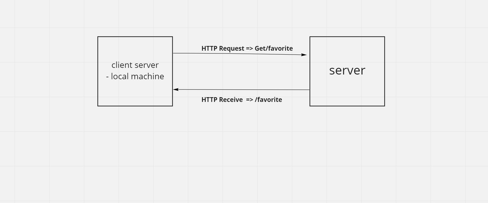

# Movies-Library || version => 1.0.0

**Author Name**: Mohammad Naji Alkresheh

## WRRC

## Overview :

### This server is design for upload a new Hollywood Movies.

## Getting Started:

- Clone this link:  " https://github.com/MohammadNaji98/Movies-Library.git"
 in your Terminal.
 - Instal npm test and express.
 - Open it with VS Code.
 - Reseve the data from data.json => {const express = require("express");
const movie = require("./Movie_Data/data.json");
const app = express();}
- Use Postman and (npm test server.js in your Terminal).

## Project Features
1. Its Easy to use.
2. Its have a new Hollywoods Movies
