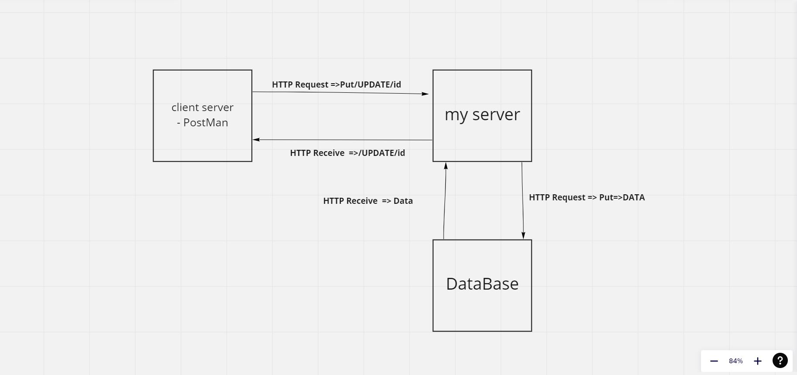

# Movies-Library || version => 1.0.0

**Author Name**: Mohammad Naji Alkresheh

## WRRC

## Overview

### This server is design for upload a new Hollywood Movies

## Getting Started

- Clone this link:  " <https://github.com/MohammadNaji98/Movies-Library.git>"
 in your Terminal.
- Instal npm test and express.
- Open it with VS Code.
- Reseve the data from data.json => {const express = require("express");
const movie = require("./Movie_Data/data.json");
const app = express();}
- Use Postman and (npm test server.js in your Terminal).

## Project Features

1. Its Easy to use.
2. Its have a new Hollywoods Movies

# ____________________________________________________________________________

## APIs today work

## WRRC

## Descreption

Now we get API from 3rd party, and we git the data from another server :)

# ____________________________________________________________________________

## WRRC

### INSERT Data to database

### GET Data from database

## Descreption

We created a database, added data to it and retrieved it from it :)

# ____________________________________________________________________________

## WRRC

### UPDATE Data into database

### DELETE Data to database

### GET Data from database via Id

## Descreption

We update and delete data into Datebase :)

# ____________________________________________________________________________
